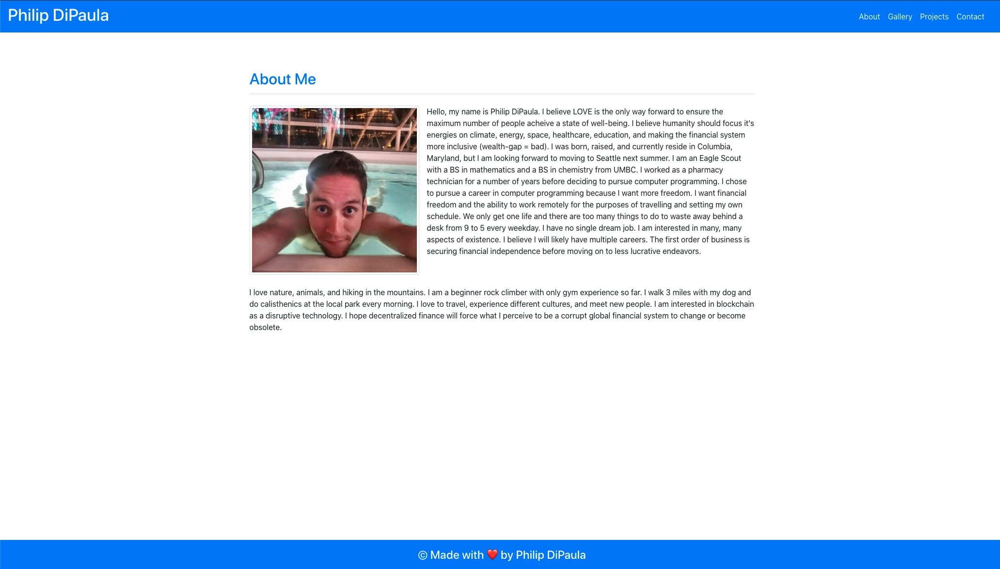

# ReactPortfolio

Here is a [link](https://pjdip.github.io/ReactPortfolio/) to the live page :D

The goal of this assignment was to create a mobile responsive portfolio using React and react-router-dom.

- [ReactPortfolio](#reactportfolio)
  - [Installation](#installation)
  - [Usage](#usage)
    - [`npm start`](#npm-start)
  - [Credits](#credits)
  - [Badges](#badges)
  - [License](#license)

## Installation

The only thing you will need to have installed in order to run the index.html file is a functioning web browser. It should work with most versions of most browswers. I recommend the Brave browser, as you will be paid in the Basic Attention Token (BAT) for viewing ads, instead of being bombarded with ads and getting nothing for it.

## Usage 

In the project directory, you can run:

### `npm start`

Runs the app in the development mode.\
Open [http://localhost:3000](http://localhost:3000) to view it in the browser.

The page will reload if you make edits.\
You will also see any lint errors in the console.

Here are a few images of the page (notice the navbar indicating which section you are currently in):

## Credits

Thanks to react-bootstrap:
* [npm](https://www.npmjs.com/package/react-bootstrap)
* [docs](https://react-bootstrap.github.io/getting-started/introduction/)

Thanks to react-router-dom:
* [npm](https://www.npmjs.com/package/react-router-dom)
* [docs](https://reactrouter.com/web/guides/quick-start)

Thanks to create-react-app [docs](https://create-react-app.dev/docs/using-the-public-folder/) for help accessing images in the public folder

Thanks to stack-overflow for [info](https://stackoverflow.com/questions/50709625/link-with-target-blank-and-rel-noopener-noreferrer-still-vulnerable) related to a complaint react was giving me

Help with deployment:
* [medium](https://medium.com/@arijit_chowdhury/deploy-react-app-with-react-router-to-github-pages-for-free-569377f483f) gave me some info about using "basename" with <BrowserRouter>
* [stackoverflow](https://stackoverflow.com/questions/61300429/react-app-hashrouter-not-working-on-localhost-as-well-as-github-user-page) helped with my navigation issues

Special Thanks to [ChilledCow](https://www.youtube.com/channel/UCSJ4gkVC6NrvII8umztf0Ow) for providing chill lofi beats to code to

## Badges

## License

Licensed under the [GNU General Public License v3.0](https://choosealicense.com/licenses/gpl-3.0/)

---